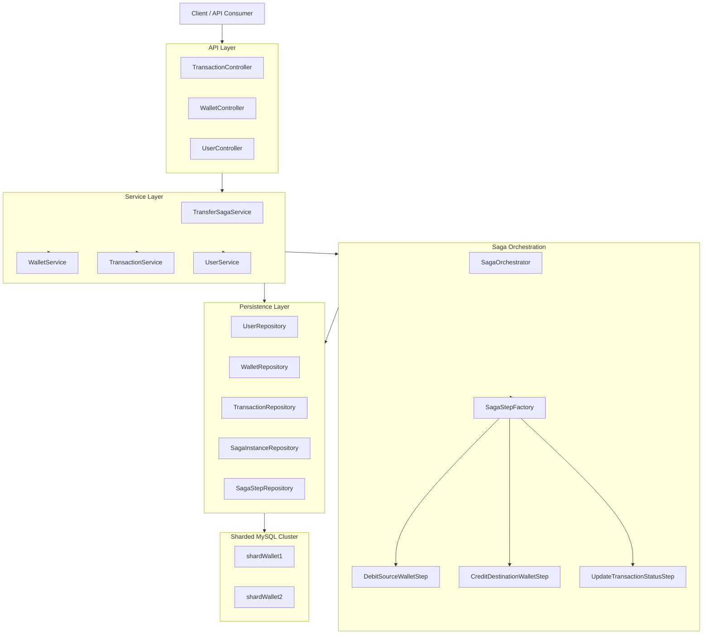
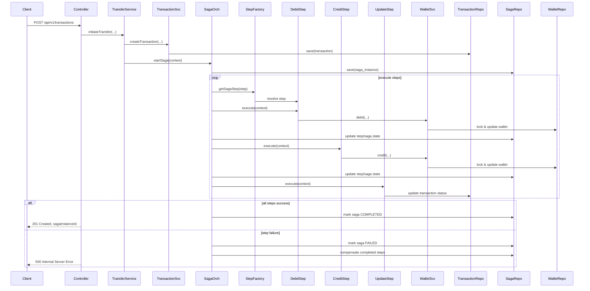
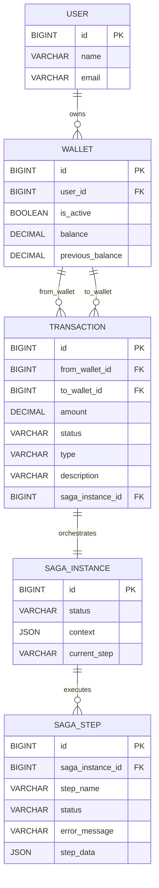

# Sharded Saga Wallet

A Java Spring Boot application implementing a distributed wallet transfer system using the Saga pattern combined with Apache ShardingSphere for horizontally sharded persistence. This project demonstrates resilient transaction orchestration, compensation, and multi-shard data management for wallet transfers.

---

## Short Summary

A production-oriented distributed wallet transfer microservice built with Spring Boot, Apache ShardingSphere, and the Saga pattern. Designed for resume presentation, this project highlights resilient distributed transaction orchestration, multi-shard persistence, compensation support, and clean service-oriented architecture.

---

## Table of Contents

- [Short Summary](#short-summary)
- [Overview](#overview)
- [Key Features](#key-features)
- [Architecture](#architecture)
- [High-Level Design](#high-level-design)
- [Low-Level Design](#low-level-design)
- [Code Flow](#code-flow)
- [API Documentation](#api-documentation)
- [Domain Model](#domain-model)
- [Database Design](#database-design)
- [Persistence and Sharding](#persistence-and-sharding)
- [Resilience and Compensation](#resilience-and-compensation)
- [Setup and Run](#setup-and-run)
- [Configuration](#configuration)
- [Future Enhancements](#future-enhancements)
- [Resume Summary](#resume-summary)

---

## Overview

`ShardedSagaWallet` is a wallet transfer microservice built with Spring Boot, Spring Data JPA, and Apache ShardingSphere. It supports:

- user creation and lookup
- wallet creation, balance inquiry, debit, and credit
- transfer orchestration via the Saga pattern
- resilient compensation when transfer steps fail
- horizontal data sharding across multiple MySQL databases

This repo was designed for production-grade distributed transaction handling and demonstrates modern design patterns in a real-world-like payment flow.

---

## Key Features

- Saga-based wallet transfer orchestration
- Transactional compensation for rollback semantics
- Sharded persistence with Apache ShardingSphere
- `REQUIRES_NEW` transaction propagation in saga steps
- Retry support for compensation using Resilience4j
- Clean separation of controllers, services, repositories, and saga orchestration
- DTO-based API contracts and validation

---

## Architecture

### System Component Diagram



### Saga Execution Sequence



---

<a name="high-level-design"></a>
## High-Level Design

### Layered Architecture

- **Controllers**: REST entrypoints for wallet, user, and transaction operations
- **Services**: Business logic and orchestration implemented in service classes
- **Saga Orchestrator**: Centralized workflow manager for distributed transaction steps
- **Repositories**: Spring Data JPA repositories for persistence
- **Entities**: Domain models representing user, wallet, transaction, saga instance, and saga step

### High-Level Design Patterns

- **Saga Pattern**: Core architecture for distributed transaction processing. It allows the service to coordinate multiple operations across bounded contexts and persist saga state.
- **Sharding Pattern**: Database horizontal partitioning through Apache ShardingSphere to scale read/write capacity and reduce cross-shard contention.
- **Layered Architecture**: Separates API, business logic, orchestration, and persistence concerns for maintainability and testability.
- **Dependency Injection**: Spring wiring supports loose coupling and easier component substitution.
- **Resilience Pattern**: Retry-based compensation improves fault tolerance for distributed rollback.

<a name="low-level-design"></a>
## Low-Level Design

### Low-Level Design Patterns

- **Factory Pattern**: `SagaStepFactory` maps `SagaSteps` to concrete step implementations.
- **Strategy Pattern**: `SagaStepInterface` defines interchangeable `execute()` and `compensate()` behaviors for each saga step.
- **Builder Pattern**: Lombok builders simplify object creation for entities like `Wallet`, `Transaction`, and `SagaInstance`.
- **Repository Pattern**: Spring Data JPA repository interfaces encapsulate persistence queries and data access.
- **Transactional Pattern**: `@Transactional(propagation = Propagation.REQUIRES_NEW)` isolates each saga step into its own transaction.

---

## Code Flow

### 1. Transfer Request Flow

1. `POST /api/v1/transactions` is called with transfer payload.
2. `TransactionController` delegates to `TransferSagaService.initiateTransfer()`.
3. `TransferSagaService.createSagaData()` creates a persistent `Transaction` record.
4. A new `SagaInstance` is created with context data containing wallet IDs, user IDs, amount, and transaction ID.
5. The saga executes each step in order:
   - `DEBIT_SOURCE_WALLET_STEP`
   - `CREDIT_DESTINATION_WALLET_STEP`
   - `UPDATE_TRANSACTION_STATUS_STEP`
6. Each step updates its `SagaStep` status and persists context changes.
7. If all steps succeed, saga status becomes `COMPLETED`.
8. If any step fails, `SagaOrchestrator.failSaga()` triggers compensation in reverse order.

### 2. Compensation Flow

- If debit or credit fails, the orchestrator marks the saga as `FAILED`.
- `SagaOrchestrator.compensateSaga()` loads completed steps and compensates them in reverse order.
- Compensation retries are managed by Resilience4j.
- Example: if credit fails after debit succeeded, debit is compensated by crediting the source wallet back.

---

## API Documentation

### Base URL

`http://localhost:3005/api/v1`

### User APIs

#### Create User

- `POST /users`
- Request body:
  ```json
  {
    "name": "Alice",
    "email": "alice@example.com"
  }
  ```
- Response: created `User` object

#### Get User by ID

- `GET /users/{id}`
- Response: `User` object

#### Get Users by Name

- `GET /users/name?name=alice`
- Response: list of matching users

### Wallet APIs

#### Create Wallet

- `POST /wallets`
- Request body:
  ```json
  {
    "userId": 1
  }
  ```
- Response: newly created `Wallet`

#### Get Wallet

- `GET /wallets/{id}`
- Response: `Wallet` object

#### Get Wallet Balance

- `GET /wallets/{id}/balance`
- Response: current wallet balance as number

#### Debit Wallet

- `POST /wallets/debit`
- Request body:
  ```json
  {
    "walletId": 1,
    "userId": 1,
    "amount": 50
  }
  ```
- Response: updated `Wallet`

#### Credit Wallet

- `POST /wallets/credit`
- Request body:
  ```json
  {
    "walletId": 2,
    "userId": 2,
    "amount": 50
  }
  ```
- Response: updated `Wallet`

### Transaction API

#### Create Transfer Transaction

- `POST /transactions`
- Request body:
  ```json
  {
    "fromWalletId": 1,
    "fromUserId": 1,
    "toWalletId": 2,
    "toUserId": 2,
    "amount": 100,
    "description": "Payment"
  }
  ```
- Response:
  ```json
  {
    "sagaInstanceId": 123
  }
  ```

This call starts a full Saga orchestration, performs debit/credit operations, and updates the transaction status accordingly.

---

## Domain Model

### Wallet

- `id`
- `userId`
- `isActive`
- `balance`
- `previousBalance`

Operations:
- `debit(amount)` validates sufficient balance
- `credit(amount)` increases balance

### Transaction

- `id`
- `fromWalletId`
- `toWalletId`
- `amount`
- `status` (`PENDING`, `SUCCESS`, `FAILED`, `CANCELLED`)
- `type` (`TRANSFER`, `DEPOSIT`, `WITHDRAWAL`)
- `description`
- `sagaInstanceId`

### Saga Instance

- `id`
- `status` (`STARTED`, `RUNNING`, `COMPLETED`, `FAILED`, `COMPENSATING`, `COMPENSATED`)
- `context` JSON blob
- `currentStep`

### Saga Step

- `id`
- `sagaInstanceId`
- `stepName`
- `status`
- `errorMessage`
- `stepData`

---

## Database Design

This section outlines the relational database schema used for the sharded wallet system. The design supports horizontal partitioning across multiple MySQL shards while maintaining referential integrity within each shard.

### Entity-Relationship Diagram



### Table Schemas

#### `user`
```sql
CREATE TABLE user (
    id BIGINT PRIMARY KEY AUTO_INCREMENT,
    name VARCHAR(255),
    email VARCHAR(255)
);
```

#### `wallet`
```sql
CREATE TABLE wallet (
    id BIGINT PRIMARY KEY AUTO_INCREMENT,
    user_id BIGINT NOT NULL,
    is_active BOOLEAN DEFAULT TRUE,
    balance DECIMAL(19,2) DEFAULT 0.00,
    previous_balance DECIMAL(19,2) DEFAULT 0.00,
    FOREIGN KEY (user_id) REFERENCES user(id)
);
```

#### `transaction`
```sql
CREATE TABLE transaction (
    id BIGINT PRIMARY KEY AUTO_INCREMENT,
    from_wallet_id BIGINT,
    to_wallet_id BIGINT,
    amount DECIMAL(19,2) NOT NULL,
    status ENUM('PENDING', 'SUCCESS', 'FAILED', 'CANCELLED') DEFAULT 'PENDING',
    type ENUM('TRANSFER', 'DEPOSIT', 'WITHDRAWAL') DEFAULT 'TRANSFER',
    description VARCHAR(500),
    saga_instance_id BIGINT,
    FOREIGN KEY (from_wallet_id) REFERENCES wallet(id),
    FOREIGN KEY (to_wallet_id) REFERENCES wallet(id),
    FOREIGN KEY (saga_instance_id) REFERENCES saga_instance(id)
);
```

#### `saga_instance`
```sql
CREATE TABLE saga_instance (
    id BIGINT PRIMARY KEY AUTO_INCREMENT,
    status ENUM('STARTED', 'RUNNING', 'COMPLETED', 'FAILED', 'COMPENSATING', 'COMPENSATED') DEFAULT 'STARTED',
    context JSON,
    current_step VARCHAR(255)
);
```

#### `saga_step`
```sql
CREATE TABLE saga_step (
    id BIGINT PRIMARY KEY AUTO_INCREMENT,
    saga_instance_id BIGINT NOT NULL,
    step_name VARCHAR(255) NOT NULL,
    status ENUM('PENDING', 'RUNNING', 'COMPLETED', 'FAILED', 'COMPENSATING', 'COMPENSATED', 'SKIPPED') DEFAULT 'PENDING',
    error_message VARCHAR(1000),
    step_data JSON,
    FOREIGN KEY (saga_instance_id) REFERENCES saga_instance(id)
);
```

### Key Relationships and Constraints

- **User-Wallet**: One-to-many (a user can have multiple wallets)
- **Wallet-Transaction**: Many-to-many through `from_wallet_id` and `to_wallet_id`
- **Transaction-Saga Instance**: One-to-one (each transaction is orchestrated by one saga)
- **Saga Instance-Saga Step**: One-to-many (a saga executes multiple steps)
- **Foreign Keys**: Enforced within each shard; cross-shard references are handled at the application level
- **Indexes**: Primary keys are auto-indexed; consider adding indexes on `user_id`, `from_wallet_id`, `to_wallet_id`, and `saga_instance_id` for query performance

### Design Considerations

- **Sharding Compatibility**: Tables are designed for horizontal partitioning by ID or user_id to minimize cross-shard queries
- **JSON Storage**: `context` and `step_data` use JSON columns for flexible saga state persistence
- **Enums**: Status and type fields use ENUMs for data integrity and performance
- **Decimal Precision**: Balance and amount fields use DECIMAL(19,2) for accurate financial calculations

---

## Persistence and Sharding

This project uses Apache ShardingSphere to distribute data across multiple MySQL shards.

### Sharded Tables

- `user`
- `wallet`
- `transaction`
- `saga_instance`
- `saga_step`

### Sharding Rules

- `user`: sharded by `id`
- `wallet`: sharded by `user_id`
- `transaction`: sharded by `id`
- `saga_instance`: sharded by `id`
- `saga_step`: sharded by `id`

### Sharding Config

The application uses `src/main/resources/sharding.yml` and system properties for shard credentials. Each configured shard points to a separate MySQL datasource.

### Benefits

- horizontal scalability
- reduced single-node storage pressure
- improved query isolation per shard

---

## Resilience and Compensation

### Saga Orchestration

This system implements a coordinator-driven Saga:

- `SagaOrchestrator.startSaga()` creates the saga instance and persists context
- `executeStep()` runs each step sequentially
- if any step fails, `failSaga()` triggers compensation
- `compensateSaga()` compensates completed steps in reverse order

### Compensation Retry

- Compensation uses Resilience4j retry configuration
- Configurable properties:
  - `sagaCompensationRetry.max-attempts`
  - `sagaCompensationRetry.wait-duration-ms`
- This ensures transient failures during rollback can be retried before marking the saga as failed permanently

### Transaction Propagation

- `WalletService.debit()` and `WalletService.credit()` use `@Transactional(propagation = Propagation.REQUIRES_NEW)`
- This isolates each saga step into its own transaction so completed steps are committed independently and can be compensated later

---

## Setup and Run

### Prerequisites

- Java 21
- Gradle
- MySQL instances for shards
- Database users and credentials

### Environment Variables

Create a `.env` file in the project root or export system properties.

Required variables:

- `SERVER_PORT` (optional, default `3005`)
- `SHARD_WALLET_1_JDBC_URL`
- `SHARD_WALLET_1_USERNAME`
- `SHARD_WALLET_1_PASSWORD`
- `SHARD_WALLET_2_JDBC_URL`
- `SHARD_WALLET_2_USERNAME`
- `SHARD_WALLET_2_PASSWORD`
- `SAGA_COMPENSATION_RETRY_MAX_ATTEMPTS`
- `SAGA_COMPENSATION_RETRY_WAIT_DURATION_IN_MS`

Example `.env`:

```env
SERVER_PORT=3005
SHARD_WALLET_1_USERNAME=root
SHARD_WALLET_1_PASSWORD=

SHARD_WALLET_2_USERNAME=root
SHARD_WALLET_2_PASSWORD=

SHARD_WALLET_1_JDBC_URL=jdbc:mysql://localhost:3306/shardWallet1
SHARD_WALLET_2_JDBC_URL=jdbc:mysql://localhost:3306/shardWallet2

SAGA_COMPENSATION_RETRY_MAX_ATTEMPTS=3
SAGA_COMPENSATION_RETRY_WAIT_DURATION_IN_MS=2000
```

### Run the Project

```bash
./gradlew bootRun
```

### Build Artifact

```bash
./gradlew clean build
```

---

## Configuration

### `application.properties`

- `spring.datasource.url`: points to ShardingSphere driver
- `spring.datasource.driver-class-name`: `org.apache.shardingsphere.driver.ShardingSphereDriver`
- `spring.jpa.hibernate.ddl-auto=update`
- retry and server port values loaded from environment variables

### `sharding.yml`

- defines `shardWallet1` and `shardWallet2`
- configures inline shard rules for user_id and id
- uses Snowflake key generation for primary IDs

---

## Future Enhancements

- Add transaction history and query endpoints for saga state
- Implement event-based saga orchestration for better scalability
- Add support for distributed locking and dead-letter queue for failed compensations
- Improve validation error responses with standardized API error payloads
- Add OpenAPI / Swagger documentation
- Add integration tests for saga success/failure and compensation flows
- Add monitoring / metrics for saga execution and retry counts
- Implement multi-tenant routing and dynamic shard provisioning
- Add automated rollback when shard topology changes

---

## Notes for Resume

- Implemented a distributed transfer service using Spring Boot and Apache ShardingSphere
- Designed and implemented a coordinator-based Saga pattern with compensation
- Used `REQUIRES_NEW` transaction propagation to isolate step execution
- Implemented resilient retry logic using Resilience4j
- Built horizontal sharding configuration and multi-shard entity routing
- Created clean domain boundaries with controllers, services, repositories, and saga components

---

## Project Structure

- `src/main/java/com/example/ShardedSagaWallet`
  - `controllers/`
  - `dtos/`
  - `entities/`
  - `enums/`
  - `repositories/`
  - `services/`
  - `configs/`

- `src/main/resources/`
  - `application.properties`
  - `sharding.yml`

---

## Important Design Tradeoffs

- The Saga pattern was chosen to support distributed consistency without a global two-phase commit.
- ShardingSphere was used to demonstrate horizontal scaling and data partitioning with a single application layer.
- Step-level `REQUIRES_NEW` transactions ensure that completed work can be compensated separately instead of being rolled back automatically.
- The system is designed for resiliency instead of strict synchronous ACID across shards.

---

## Contact

For questions or feedback, inspect the source in `src/main/java/com/example/ShardedSagaWallet` and the configuration files under `src/main/resources`.
